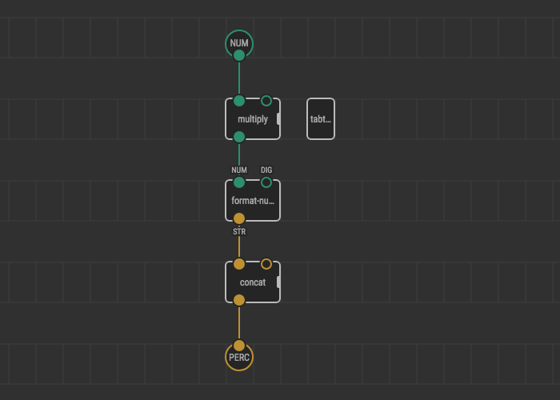
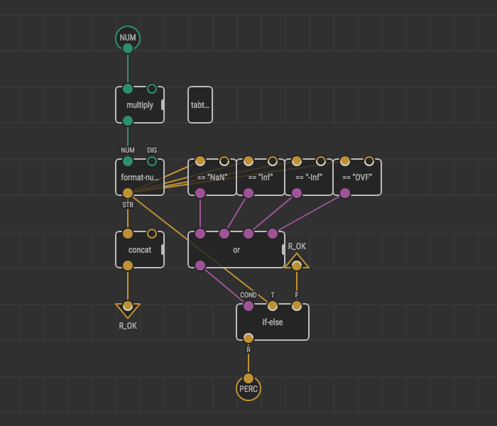
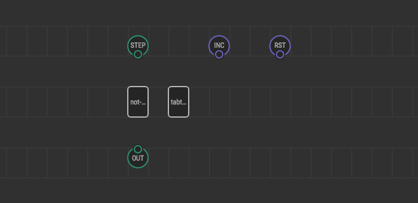
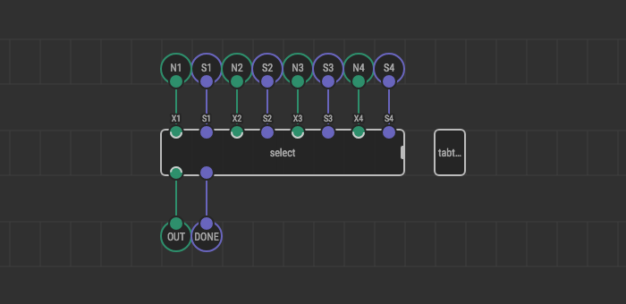

# Testing Patches

Writing tests for the code is a good practice in any programming language. It allows to write and debug code quickly with covering many possible cases ranging from the most common and ending with edge cases. Moreover, code covered by tests can be modified without worrying that broke something in other places where it used.

Also, tests often serve as excellent *documentation* of what is expected at outputs with specific parameters at inputs.

Testing nodes in XOD implemented as tabular tests (tabtests for short). That means a test suite looks like a table. The first row contains pin labels of a tested node. All the next rows are test cases, one row is the one test case and one [transaction](/docs/guide/execution-model/) of the XOD program. In columns, input values and expected outputs for corresponding pin labels.

<div class="ui segment">
<span class="ui ribbon label">Input values and expected outputs</span>
Input values and expected outputs defined by tabtest literals, which generally is the same as literals in Inspector, but have some special literals.
See the full list of tabtest literals in the [reference](/docs/reference/tabtests/).
</div>

When you run tests, they either pass or fail with an error describing the difference between actual and expected outputs.

However, there is one limitation, you cannot test nodes, that work with hardware modules.


## Testing nodes with primitive types

Nodes with such primitive types as Strings, Numbers, Booleans are simplest to test. Let's imagine that there is no `xod/core/to-percent` node in the XOD standard library, and we implement it by ourselves.



It's a simple node that converts some number into a string with the concatenated percent character. However, what's in the output if it takes a `NaN` on the input, or `-Inf`?

First of all, place the new marker node: `xod/patch-nodes/tabtest`.

Now you can double-click on `tabtest` node, and an embedded tabtest editor opens up. It looks like a table, let's write test cases:

<table class="ui table compact">
  <thead>
    <tr>
      <th>NUM</th>
      <th>PERC</th>
    </tr>
  </thead>
  <tbody>
    <tr>
      <td>0</td>
      <td>"0%"</td>
    </tr>
    <tr>
      <td>1</td>
      <td>"100%"</td>
    </tr>
    <tr>
      <td>25.5</td>
      <td>"2550%"</td>
    </tr>
    <tr>
      <td colspan="2">// Test rounding</td>
    </tr>
    <tr>
      <td>0.735</td>
      <td>"74%"</td>
    </tr>
    <tr>
      <td>0.734</td>
      <td>"73%"</td>
    </tr>
    <tr>
      <td colspan="2">// Negative values</td>
    </tr>
    <tr>
      <td>-0.6</td>
      <td>"-60%"</td>
    </tr>
    <tr>
      <td colspan="2">// Special values</td>
    </tr>
    <tr>
      <td>NaN</td>
      <td>"NaN"</td>
    </tr>
    <tr>
      <td>Inf</td>
      <td>"Inf"</td>
    </tr>
    <tr>
      <td>-Inf</td>
      <td>"-Inf"</td>
    </tr>
    <tr>
      <td>9999999999999</td>
      <td>"OVF"</td>
    </tr>
  </tbody>
</table>

<div class="ui segment">
<span class="ui ribbon label">Note</span>
If you save the project as a multi-file project, you can find out `patch.test.tsv` file in the directory of your patch. So you can write it manually if you like. Pay attention that columns are separated by tabs (`\t`).
</div>

All right, we just wrote tests. It's time to run them.

Press the "Run tests" button in the panel above and wait for a little. It can take some time because these tests are transpiling to the C++ code, then compile in the cloud and then it executes. You can watch for the progress in the Deployment pane below: you'll see a progress bar, and you can show a pane to see details.

Tests failed! Let's inspect details in the "Tests" tab in deployment pane. Here is the lines that makes sense to us:

```
    ./to-percent.catch.inl:36: FAILED:
      REQUIRE( probe_PERC.state.lastValue == xod::XStringCString("NaN") )
    with expansion:
      "NaN%" == "NaN"
```

It tells us that we get value `"NaN%"` in the output instead of expected `"NaN"`. We just caught a bug! Let's fix it and rerun tests:



Now you see a green notification message about passed tests.

You just wrote tests, found a bug and fixed it. Congratulations!

<div class="ui segment">
<span class="ui ribbon label">Note</span>
You can write tabtests for the nodes with C++ implementation in the same way, just place `xod/patch-nodes/tabtest` marker node and fulfill the table.
</div>


<a name="impureness"></a>
## Impure tests for impure nodes

We just tested the pure node. But how to deal with impure, like `xod/core/count`?



All right, we did not tighten the nuts so that we can test these nodes too, but we have to keep it in mind when we are writing tests for them. Each next test case did not reset the state of the previous test cases, so if you send pulse twice in the `INC` pin of the `count` node, it outputs `2` in the second case. If you want to start over — add a new test case and send `pulse` to the `RST` pin.

<table class="ui table compact">
  <thead>
    <tr>
      <th>STEP</th>
      <th>INC</th>
      <th>RST</th>
      <th>OUT</th>
    </tr>
  </thead>
  <tbody>
    <tr>
      <td>1</td>
      <td>no-pulse</td>
      <td>no-pulse</td>
      <td>0</td>
    </tr>
    <tr>
      <td>1</td>
      <td>pulse</td>
      <td>no-pulse</td>
      <td>1</td>
    </tr>
    <tr>
      <td>1</td>
      <td>pulse</td>
      <td>no-pulse</td>
      <td>2</td>
    </tr>
    <tr>
      <td>1</td>
      <td>no-pulse</td>
      <td>pulse</td>
      <td>0</td>
    </tr>
    <tr>
      <td colspan="4">// And so on...</td>
    </tr>
  </tbody>
</table>

<div class="ui segment">
<span class="ui ribbon label">Note</span>
Do not forget to test edge cases like pulses in both pulse pins `INC` and `RST`, inject `NaN` or `Inf` as steps in counter and so on. It helps to catch bugs, make the behavior of the node more obvious, and provide better documentation.
</div>


## Time flow

Some impure nodes are dependent on a time flow, like `xod/core/fade` or `xod/core/delay` and etc. To test it we can mock the time.

Just specify the column with unique magic name `__time(ms)` and specify the time in milliseconds in this column. It supports integers only. So you can travel through time and even go back in time.

However, also you have to know two things:

- Nodes that use `isTimedout` function inside or contains nodes like `xod/core/delay`, `xod/core/clock`, are marked as timed out only at the next millisecond. For example, if we set a delay for 500ms, it pulses `DONE` on the 501ms.
- When you do not use this special column, we automatically increment time flow in the tests by one millisecond before running each test case. It provides correct working of `defer` nodes inside. However, when you use `__time(ms)` column you have to update it manually. So if you want to test something with the same time at each row, you probably do not need this column at all.

You can checkout tabtests in these nodes to understand how it looks and works: `xod/core/delay`, `xod/core/clock`, `xod/core/fade`, `xod/core/system-time`.

<div class="ui segment">
<span class="ui ribbon label">Note</span>
We recommend placing `__time(ms)` column at first place to keep it clear and see what time is it. However, you can place it in any place of the table.
</div>


## Variadics, generics, custom types

To test nodes with variadics, generics or custom types do the next:

1. Create a special patch with name describes the test and put your node or nodes that you want to cover with test inside
2. Place terminals with primitive types
3. Place `xod/patch-nodes/tabtest`
4. Write tests

For example, you can make

- `test-select-4-number`, which tests selecting one of the four numbers by pulses,
- `test-add-vectors`, which makes two custom types `vector` from primitive input-numbers, then add one to another and then unfold it back to primitives.

Let's look at the first example in more detail.



And some test cases:

<table class="ui table compact">
  <thead>
    <tr>
      <th>N1</th>
      <th>S1</th>
      <th>N2</th>
      <th>S2</th>
      <th>N3</th>
      <th>S3</th>
      <th>N4</th>
      <th>S4</th>
      <th>OUT</th>
      <th>DONE</th>
    </tr>
  </thead>
  <tbody>
    <tr>
      <td>1</td>
      <td>no-pulse</td>
      <td>2</td>
      <td>no-pulse</td>
      <td>3</td>
      <td>no-pulse</td>
      <td>4</td>
      <td>no-pulse</td>
      <td>0</td>
      <td>no-pulse</td>
    </tr>
    <tr>
      <td>1</td>
      <td>pulse</td>
      <td>2</td>
      <td>no-pulse</td>
      <td>3</td>
      <td>no-pulse</td>
      <td>4</td>
      <td>no-pulse</td>
      <td>1</td>
      <td>pulse</td>
    </tr>
    <tr>
      <td>1</td>
      <td>no-pulse</td>
      <td>2</td>
      <td>pulse</td>
      <td>3</td>
      <td>no-pulse</td>
      <td>4</td>
      <td>no-pulse</td>
      <td>2</td>
      <td>pulse</td>
    </tr>
    <tr>
      <td>1</td>
      <td>no-pulse</td>
      <td>2</td>
      <td>no-pulse</td>
      <td>3</td>
      <td>pulse</td>
      <td>4</td>
      <td>no-pulse</td>
      <td>3</td>
      <td>pulse</td>
    </tr>
    <tr>
      <td>1</td>
      <td>no-pulse</td>
      <td>2</td>
      <td>no-pulse</td>
      <td>3</td>
      <td>no-pulse</td>
      <td>4</td>
      <td>pulse</td>
      <td>4</td>
      <td>pulse</td>
    </tr>
    <tr>
      <td>1</td>
      <td>no-pulse</td>
      <td>2</td>
      <td>no-pulse</td>
      <td>3</td>
      <td>no-pulse</td>
      <td>4</td>
      <td>no-pulse</td>
      <td>0</td>
      <td>no-pulse</td>
    </tr>
  </tbody>
</table>

---

Well, now you know how to write and run tests. So now it might help you to write more stable programs.

Moreover, this is the time to tell you about test-driven development. It's a development process when a developer writes tests before write code. It provides productivity, quality, and confidence to the final program. Also, when you write test cases, some things can become evident for you, like "it should be two small nodes instead of the huge one" or "oh, it could return invalid values and how I should deal with it?"

Also, its a lot faster to run tests than upload code to the board after each change and test all possible cases manually.

So we recommend using TDD when you're making some nodes that are not about hardware and detach all logic from the hardware to test it quickly.

Let's summarize:

1. Tests help to make a stable program.
2. Tests serve as proper documentation.
3. Tests provide developer improving the code without worrying about code consumers.
4. Test-driven development is possible in XOD IDE.
5. Development becomes faster and more stable with tests.
